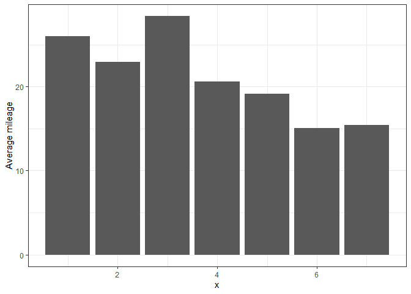
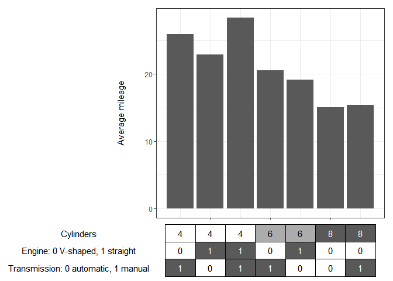
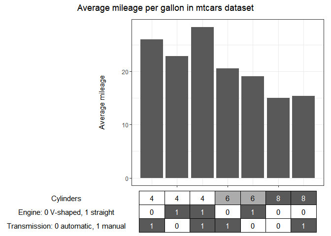
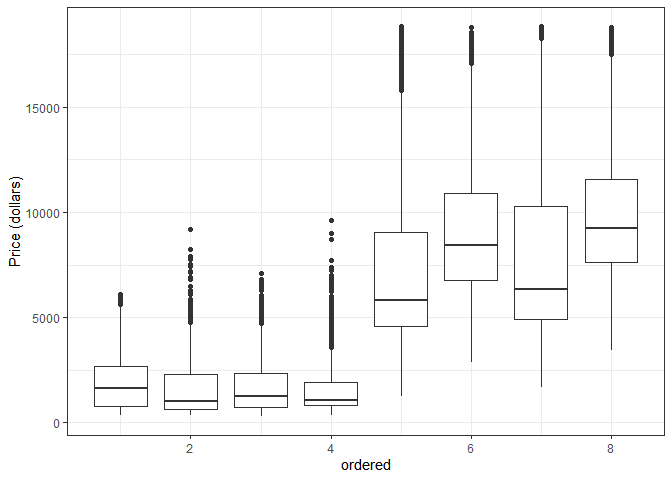
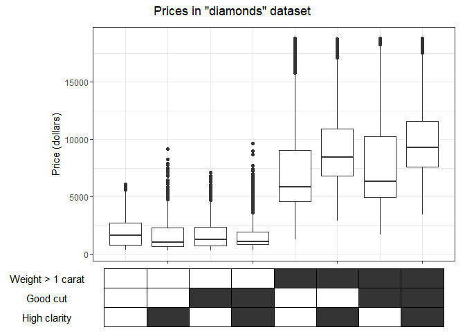
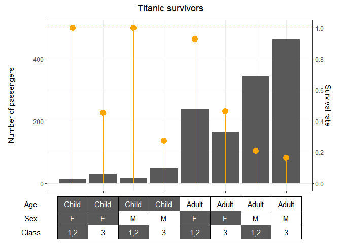

Factor table axis
================
Szymon Steczek
2024-03-07

Let’s say there is a target variable, that we want to optimize and a set
of independent variables, which we suspect to affect the target in some
intercorrelated fashion. The design might be particularly useful for
early exploratory tasks.

I recently created a ggplot +patchwork variation of the categorical data
plots, designed to visualize the changes of the parameters, across
groups defined by multiple qualitative variables. This approach utilizes
a table, instead of a standard x axis. Thanks to it, when levels of
interest are permutations of the variables that we have a control over,
we can refer to these variables directly, instead of creating an
artificial x variable. The design can be thought of as visualization of
the aggregative data transformations: e.g. calculate the mean by groups
defined by variables x1 and x2.

``` r
tableaxis = function(
    df #dataframe, where each rows corresponds to a point on the main plot. Rows have to follow the same order as points on the plot.
    , variables #rows of the table axis. Have to be: numeric, logical or ordered factor.
    , var_names = NULL #customize the names of the table axis
    , main_plot = NULL #the main plot. If nothing is supplied, only the table axis is returned
    , text_var_values = TRUE #should the table cells be described?
    , greyxx = 35 #the darkest shade of grey to be used. 35 is one of ggplot basics, 00 is black
    , reverse_cols = FALSE #reverse the scale of the colors in the table
    , y_axis_label_margin = 60  
    ){
  
  m = length(variables) #this will be number of rows in the table
  n = dim(df)[1] #number of columns in the table
  if(is.null(var_names)) var_names = variables  
  text_scaling_factor = max(nchar(var_names))
  
  for(i in variables){ #if variables are numeric or logical, infer the factors order
    if(is.numeric(df[[i]])) df[[i]] = factor(df[[i]], ordered = TRUE)
    if(is.logical(df[i])) df[[i]] = factor(df[[i]], ordered = TRUE)
    if(sum(is.na(df[i])) > 0){
      message("Error: Missing values not permitted in the variables' levels.") 
      return(NULL)
    }
  }
  if(!missing(main_plot)){
    p1 = main_plot 
    if(!inherits(main_plot, 'ggplot')){
      message("Error: main_plot was supplied but wasn't recognized as a ggplot object.") 
      return(NULL)
    }
    bp1 = ggplot_build(main_plot)
    if(!prod(bp1$data[[1]]$x == 1:n)){
      message("Error: x range inferred from parameters df and main_plot are different. df implies a range 1:", n, ", while main_plot implies ", bp1$data[[1]]$x[1], ":", rev(bp1$data[[1]]$x)[1], ". Ranges have to be integers 1 through number of points.")
      return(NULL)
    }
    xlimits = bp1$layout$panel_params[[1]]$x.range
    if(xlimits[1] > 0.5 | xlimits[2] < n + 0.5){
      xlimits = c(min(xlimits[1], 0.5), max(xlimits[2], n + 0.5))
      p1 = p1 + scale_x_continuous(expand = expansion(mult = c(0, 0)), limits = xlimits, breaks = 1:n) + xlab(NULL) + theme(axis.text.x = element_blank(), axis.title.y = element_text(margin = margin(r = -text_scaling_factor*10+y_axis_label_margin, unit = "pt")))
      message('main_plot: a too narrow x-axis margin was adjusted. \n')
    }
    else{
      p1 = p1 + xlab(NULL) + theme(axis.text.x = element_blank(), axis.title.y = element_text(margin = margin(r = -text_scaling_factor*10+y_axis_label_margin, unit = "pt")))
    }
  } 
  extract_levels <- function(factor_column) {
    as.numeric(factor_column)
  }
  color_scale = data.frame(lapply(df[variables], extract_levels)) - 1
  color_scale = as.matrix(color_scale)%*%diag(1/apply(color_scale,2, max))
  
  data.frame(lapply(df[variables], as.character)) %>% pivot_longer(cols = all_of(variables)) -> tdf
  tdf2 = tdf %>% rename(var = name) %>% mutate(x = rep(1:n, each = m), y = m - rep(1:m, times = n))
  if(reverse_cols){
    color_vector = c(color_scale)*(1 - greyxx/100) + greyxx/100
  }
  else{
    color_vector = - (c(color_scale)*(1 - greyxx/100) + greyxx/100) + greyxx/100 + 1
  }

  tdf2$color_scale = c(t(matrix(rgb(color_vector, color_vector, color_vector), ncol = m)))
  get_text_color = function(hex_colors) {
    rgb_colors = col2rgb(hex_colors)
    luminance = 0.2126 * rgb_colors[1, ] + 0.7152 * rgb_colors[2, ] + 0.0722 * rgb_colors[3, ]
    text_color = ifelse(luminance > 128, "#000000", "#FFFFFF")
    return(text_color)
  }

  tdf2$text_color = get_text_color(tdf2$color_scale) 
  p2 = tdf2 %>% ggplot(aes(x,y)) +
    geom_tile(fill = tdf2$color_scale, color = 'black') +
    scale_x_continuous(expand = expansion(mult = c(0, 0)), limits = xlimits) +
    scale_y_continuous(expand = expansion(mult = c(0, 0)), limits = c(-0.5, 0.5+(m-1)), breaks = (0:(m-1)), labels = rev(paste(var_names, "  "))) +
    xlab(NULL) + theme(axis.text.x = element_blank()) +
    ylab(NULL) + theme_void() + theme(axis.text.y = element_text())
  
  if(text_var_values) p2 = p2 + geom_text(aes(x, y, label = value), tdf2 , color = tdf2$text_color)
  if(missing(main_plot)) return(p2)
  return(p1/p2 +  plot_layout(heights = c(8, 2), widths = c()))
}
```

## Mileage plot

First, say we want to choose the car with the best milage from mtcars
dataset, just by manipulating the number of cylinders, engine type and
transmission type. The task is easy to perform in dplyr by aggregation.

``` r
df = mtcars

df %>% group_by(cyl, vs, am) %>% summarise(avg_mpg = mean(mpg)) -> tdf
```

    ## `summarise()` has grouped output by 'cyl', 'vs'. You can override using the
    ## `.groups` argument.

``` r
tdf
```

    ## # A tibble: 7 × 4
    ## # Groups:   cyl, vs [5]
    ##     cyl    vs    am avg_mpg
    ##   <dbl> <dbl> <dbl>   <dbl>
    ## 1     4     0     1    26  
    ## 2     4     1     0    22.9
    ## 3     4     1     1    28.4
    ## 4     6     0     1    20.6
    ## 5     6     1     0    19.1
    ## 6     8     0     0    15.0
    ## 7     8     0     1    15.4

However, we can improve on this design by visualizing this aggregated
table. In order to do it, let’s record the order of rows in the table
into the variable x.

``` r
tdf %>% ungroup() %>% mutate(x = row_number()) -> tdf

tdf
```

    ## # A tibble: 7 × 5
    ##     cyl    vs    am avg_mpg     x
    ##   <dbl> <dbl> <dbl>   <dbl> <int>
    ## 1     4     0     1    26       1
    ## 2     4     1     0    22.9     2
    ## 3     4     1     1    28.4     3
    ## 4     6     0     1    20.6     4
    ## 5     6     1     0    19.1     5
    ## 6     8     0     0    15.0     6
    ## 7     8     0     1    15.4     7

Next, we can create a basic bar ggplot of x and mileage.

``` r
tdf %>% ggplot(aes(x, avg_mpg)) + geom_bar(stat = 'identity') + ylab('Average mileage') + theme_bw() -> p1

p1
```

<!-- -->

And combine it with the table of independent variables. Color-coding
represents the order of the variables’ levels. The independent variables
have to be logical, integer or ordered factor.

``` r
tableaxis(tdf
          , variables = c('cyl', 'vs', 'am')
          , var_names = c('Cylinders', 'Engine: 0 V-shaped, 1 straight', 'Transmission: 0 automatic, 1 manual')
          , main_plot = p1) -> p

p
```

<!-- -->

The plot is a patchwork object, a plot composed of two plots. We can
further manipulate it, as any patchwork object:

``` r
p + plot_annotation('Average mileage per gallon in mtcars dataset', theme=theme(plot.title=element_text(hjust=0.5)))
```

<!-- -->

## Diamonds prices

For the high-level exploratory tasks, we are sometimes interested in the
general direction of the impact of the continuous predictors on the
target variable, and the interactions between them. We can artificially
create binary variables by slicing continuous variables, for example
“weight 1 \> carat”. This is especially practical when the segmentation
points possess distinguishing characteristics, for example “Weight \>
Obesity threshold”.

Let’s look at the diamond prices by size, cut quality and clarity.

``` r
tdf = diamonds

tdf
```

    ## # A tibble: 53,940 × 10
    ##    carat cut       color clarity depth table price     x     y     z
    ##    <dbl> <ord>     <ord> <ord>   <dbl> <dbl> <int> <dbl> <dbl> <dbl>
    ##  1  0.23 Ideal     E     SI2      61.5    55   326  3.95  3.98  2.43
    ##  2  0.21 Premium   E     SI1      59.8    61   326  3.89  3.84  2.31
    ##  3  0.23 Good      E     VS1      56.9    65   327  4.05  4.07  2.31
    ##  4  0.29 Premium   I     VS2      62.4    58   334  4.2   4.23  2.63
    ##  5  0.31 Good      J     SI2      63.3    58   335  4.34  4.35  2.75
    ##  6  0.24 Very Good J     VVS2     62.8    57   336  3.94  3.96  2.48
    ##  7  0.24 Very Good I     VVS1     62.3    57   336  3.95  3.98  2.47
    ##  8  0.26 Very Good H     SI1      61.9    55   337  4.07  4.11  2.53
    ##  9  0.22 Fair      E     VS2      65.1    61   337  3.87  3.78  2.49
    ## 10  0.23 Very Good H     VS1      59.4    61   338  4     4.05  2.39
    ## # ℹ 53,930 more rows

Cut and clarity are ordinal factors, so let’s partition each of these
variables into just two categories - good and bad - roughly in th middle
of the ordinal scale. Let’s pick carat = 1, as an arbitrary size
threshold.

``` r
tdf %>% mutate(Good_cut = as.numeric(cut %in% c('Premium', 'Ideal')), Desired_color = as.numeric(color %in% c('D', 'E', 'F')), Desired_clarity = as.numeric(clarity %in% c('VS1', 'VVS2', 'VVS1', 'IF')), Weights_1_carat = as.numeric(carat >= 1)) %>% select(carat, Weights_1_carat, cut, Good_cut, color, Desired_color, clarity, Desired_clarity, price) -> tdf

tdf
```

    ## # A tibble: 53,940 × 9
    ##    carat Weights_1_carat cut       Good_cut color Desired_color clarity
    ##    <dbl>           <dbl> <ord>        <dbl> <ord>         <dbl> <ord>  
    ##  1  0.23               0 Ideal            1 E                 1 SI2    
    ##  2  0.21               0 Premium          1 E                 1 SI1    
    ##  3  0.23               0 Good             0 E                 1 VS1    
    ##  4  0.29               0 Premium          1 I                 0 VS2    
    ##  5  0.31               0 Good             0 J                 0 SI2    
    ##  6  0.24               0 Very Good        0 J                 0 VVS2   
    ##  7  0.24               0 Very Good        0 I                 0 VVS1   
    ##  8  0.26               0 Very Good        0 H                 0 SI1    
    ##  9  0.22               0 Fair             0 E                 1 VS2    
    ## 10  0.23               0 Very Good        0 H                 0 VS1    
    ## # ℹ 53,930 more rows
    ## # ℹ 2 more variables: Desired_clarity <dbl>, price <int>

Let’s make a boxplot of each group. We can use cur_group_id to index the
groups we created and use them as a temporary x axis.

``` r
tdf %>% group_by( Weights_1_carat, Good_cut, Desired_clarity) %>% mutate(ordered = cur_group_id()) %>% ggplot(aes(ordered, price, group = ordered)) + geom_boxplot() + ylab('Price (dollars)') + theme_bw() -> p1

p1
```

<!-- -->

``` r
tdf %>% group_by(Weights_1_carat, Good_cut, Desired_clarity) %>% summarise(n = n()) -> tdf   
```

    ## `summarise()` has grouped output by 'Weights_1_carat', 'Good_cut'. You can
    ## override using the `.groups` argument.

``` r
tdf %>% mutate(x = row_number()) %>% ungroup() -> tdf


tableaxis(tdf, variables = c('Weights_1_carat', 'Good_cut', 'Desired_clarity'), var_names = c('Weight > 1 carat','Good cut', 'High clarity'), main_plot = p1, text_var_values = FALSE, greyxx = 20) -> p

p + plot_annotation('Prices in "diamonds" dataset', theme=theme(plot.title=element_text(hjust=0.5)))
```

<!-- -->

By slicing across multiple continuous predictors, assuming the monotonic
impact of the predictors on the target variable, we can quickly identify
the sub-populations with desired properties and subsequently refine the
criteria by adjusting the continuous thresholds. This could be
especially helpful when continuous predictors are correlated and we
suspect adverse effects for particular combinations of the predictors.
For example, notice how the median price of the diamond goes up with the
better clarity for diamonds above 1 carat, but for diamonds below 1
carat, we can observe the opposite.

## Titanic passengers

Lastly, we can present a few summary statistics simultaneously.

``` r
titanic <- as_tibble(Titanic)
titanic
```

    ## # A tibble: 32 × 5
    ##    Class Sex    Age   Survived     n
    ##    <chr> <chr>  <chr> <chr>    <dbl>
    ##  1 1st   Male   Child No           0
    ##  2 2nd   Male   Child No           0
    ##  3 3rd   Male   Child No          35
    ##  4 Crew  Male   Child No           0
    ##  5 1st   Female Child No           0
    ##  6 2nd   Female Child No           0
    ##  7 3rd   Female Child No          17
    ##  8 Crew  Female Child No           0
    ##  9 1st   Male   Adult No         118
    ## 10 2nd   Male   Adult No         154
    ## # ℹ 22 more rows

Let’s exclude the crew and treat classes as an ordered factor. Let’s
calculate the count and survival rate by Class, Sex and Age group.

``` r
titanic %>% filter(Class != 'Crew') %>% mutate(Class = factor(Class, levels = rev(c('3rd', '2nd', '1st')), ordered = TRUE), Class_1and2 = factor(ifelse(Class %in% c('1st', '2nd'), '1,2', '3'), ordered = TRUE), Age = factor(Age, levels = c('Child', 'Adult'), ordered = TRUE), Female = factor(ifelse(Sex == 'Female', 'F', 'M'), ordered = TRUE), Survived = as.numeric(Survived == 'Yes', 'Y', 'N')) %>% group_by(Age, Female, Class_1and2) %>% summarise(survivors = sum(Survived*n), n = sum(n), survival_rate = survivors/n) %>% ungroup() %>% filter(n>0) %>% arrange(Age, Female, Class_1and2) %>% mutate(x = row_number()) -> tdf
```

    ## `summarise()` has grouped output by 'Age', 'Female'. You can override using the
    ## `.groups` argument.

``` r
coeff = 1/500
tdf %>% ggplot(aes(x)) + geom_bar(aes(y = n), stat = 'identity') + geom_segment( aes(x=x, xend=x, y=0, yend=survival_rate/coeff), color="orange") + geom_point(aes(y = survival_rate/coeff), color="orange", size=4) +  scale_y_continuous(
    name = "Number of passengers",
    sec.axis = sec_axis(~.*coeff, name="Survival rate"
                        , breaks = seq(0, 1, by = 0.2)),
    breaks = round(seq(0, 1300, by = 200),1)
  ) + geom_hline(yintercept = 500, col = 'orange', linetype = 2) + theme( axis.line.y.right = element_line(color = "orange"), 
       axis.ticks.y.right = element_line(color = "orange"), axis.line.y.left = element_line(color = "grey35")) + theme_bw() -> p1

tableaxis(tdf, variables = c('Age', 'Female', 'Class_1and2'), var_names = c('Age', 'Sex', 'Class'), main_plot = p1, text_var_values = TRUE, greyxx = 35, reverse_cols = TRUE) -> p

p + plot_annotation('Titanic survivors', theme=theme(plot.title=element_text(hjust=0.5)))
```

<!-- -->
